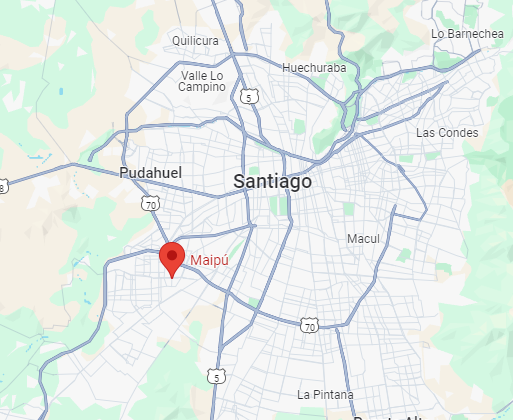

    <h1 align="center" style="color: black;">
        Nicole Maturana Morales 
      </h1>
      

        
      

       
    <h2 style="color: black; text-align: justify;">

Desarrolladora web con experiencia en herramientas como Python, HTML y CSS, complementada por una sólida formación en ciencias de la ingeniería con mención oceánica. Destaca por su proactividad, organización y responsabilidad, así como por su habilidad para trabajar en equipo y cumplir metas. Apasionada por el aprendizaje continuo, siempre en búsqueda de nuevos conocimientos para adaptarse a las demandas del mercado
    </h2>
    <h2 style="color: black; text-align: justify;">
 
Nacida en la comuna de Maipú, en la ciudad de Santiago, Chile.
      </h2>  
      

        
        
      

       
      <h2 style="color: black; text-align: justify;">
        He participado en proyectos de ingeniería marítima entre los que se incluyen estudios de caracterización del medio, evaluaciones de riesgo de tsunami, diseño de instalaciones experimentales para la modelación de ondas largas, diseños de ingeniería portuaria, proyectos de ingeniería costera, diseño de bocatomas, emisarios y descargas submarinas, evaluación del potencial energético de oleaje y mareas, proyectos hidráulicos y estudios de transporte de sedimentos. 
      </h2>
      <h2 style="color: black;"> Formación académica:
      

       
      <li>Contabilidad, Insituto Comercial Blas Cañas 2009</li>
      <li>Ingeniería civil oceanica, Universidad de Valparaíso 2022</li>  
      <li>Desarrollo full stack python, Academia Desafío Latam 2024 </li>
      

      </h2>
      <h2 style="color: black;"> Aptitudes técnicas:
      

       
      <li>Python</li>
      <li>PostgresSQL</li>  
      <li>Django</li>
      <li>HTML</li>
      

      </h2>
      <h2  style="color: black; text-align: justify;">
        Contáctame
        

         
        <li>nicol.maturanam@gmail.com</li>
        
        

      </h2>

